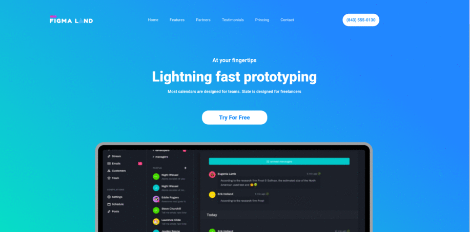

# meusProjetos
:mortar_board: Meus Projetos..

# Movie-card-libray

[Technologies](#Technologies-Movie-card-libray)  |  [How To Use](#how-to-use-Movie-card-libray)  |  [My Purpose](#my-purpose-Movie-card-libray) | [Challenge I Faced ](#challenge-i-faced-Movie-card-libray)
</br></br>


========================= ## =========================
<a id="Technologies-Movie-card-libray"></a>

### < Technologies />

:arrow_right:  This project was developed with the following technologies:

- [Reactjs](https://reactjs.org/)

========================= ## =========================
<a id="how-to-use-Movie-card-libray"></a>

### < How To Use />
:hash: To clone and run this application, you will need Git, Node.js v14.15 or higher installed on your computer. From your command line:

```
# Clone this repository
$ git clone git@github.com:Marcelllombm/meusprojetos.git

# Go into the repository
$ cd meusprojetos

# Enter the branch app-produtos
$ git checkout Movie-card-libray

# enter the folder
$ cd Movie-card-libray

# Install dependencies
$ npm install or yarn

# Run the app
$ npm start or yarn start
```
========================= ## =========================
<a id="my-purpose-Movie-card-libray"></a>

### < My Purpose />

:dart: The objectives of this project are: Redo the trybe projects and practice more ..

========================= ## =========================
<a id="challenge-i-faced-Movie-card-libray"></a>

### < Challenge I Faced />
:cyclone: use class method and not hooks

<hr>

# Figma-land
## [See result - LINK](https://marcelllombm.github.io/figma-land/)
[Technologies](#Technologies-figma-land)  |  [How To Use](#how-to-use-figma-land)  |  [My Purpose](#my-purpose-figma-land) | [Challenge I Faced ](#challenge-i-faced-figma-land)
</br></br>


========================= ## =========================
<a id="Technologies-figma-land"></a>

### < Technologies />

:arrow_right:  This project was developed with the following technologies:

- [Reactjs](https://reactjs.org/)
- [Styled-components](https://www.npmjs.com/package/styled-components)
- [React-icons](https://www.npmjs.com/package/react-icons)
- [ScrollReveal](https://www.npmjs.com/package/scrollreveal)

========================= ## =========================
<a id="how-to-use-figma-land"></a>

### < How To Use />
:hash: To clone and run this application, you will need Git, Node.js v14.15 or higher installed on your computer. From your command line:

```
# Clone this repository
$ git clone git@github.com:Marcelllombm/meusprojetos.git

# Go into the repository
$ cd meusprojetos

# Enter the branch app-produtos
$ git checkout figma-land

# enter the folder
$ cd figma-land

# Install dependencies
$ npm install or yarn

# Run the app
$ npm start or yarn start
```
========================= ## =========================
<a id="my-purpose-figma-land"></a>

### < My Purpose />

:dart: The objectives of this project are: First, to practice the styled-components; Second, make a responsive landing page.

========================= ## =========================
<a id="challenge-i-faced-figma-land"></a>

### < Challenge I Faced />
:cyclone: Leave the traditional concept of CSS. Learn a new modern CSS. With styled-components.

<hr>
